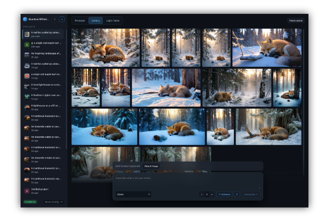
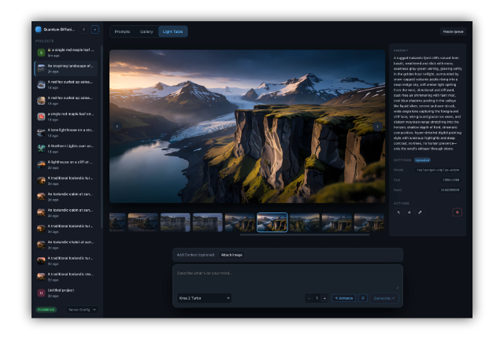

# Quantum Diffusion Server


A Midjourney-like image generation experience that runs entirely on your Mac: no account, no per-image cost, no prompt or image ever leaving the machine.
QDS gives you a prompt-and-browse **playground**, an **OpenAI-compatible API**, an **MCP server**, and **native Hermes plugins** so chat models can generate images for you, all backed by the same local diffusion models.

<p align="center">
  
  
  
</p>

## What is QDS?

Quantum Diffusion Server turns a Mac into a local image generation studio. It runs multiple models directly on Apple Silicon: pick a model, type a prompt, get an image, no cloud round-trip.

A small **menubar app** installs and runs the server for you. Everything else is a **web dashboard** served by the server itself, so there's nothing else to install, and a headless Mac gets exactly the same interface.

<p align="center">
  
</p>

Four ways in, one shared engine:

- **Playground**: a prompt box, a model picker, and a history of everything you've generated.
- **API**: the same endpoints OpenAI's `images.generate` uses at `http://127.0.0.1:8765/v1`, so any client already built for OpenAI Images (the `openai` SDK, Open WebUI, your own script) works with no adapter.
- **MCP**: point a chat model at `/mcp` (or `qds mcp` for stdio-only clients) and let it generate, refine, and upscale images as part of a conversation.
- **Hermes**: two native plugins, so images generate in the chat, or in a live playground beside it.

Because the model stays loaded in memory between requests, generating a second and third image is noticeably faster than a fresh command-line run each time, and when you're done, the memory comes back on its own.

**Requirements:** an Apple Silicon Mac (M1 or later) on macOS 14 or newer.

## Features

### Playground

The playground is where most people will spend their time: a prompt box, a model picker, and everything you generate kept in a project you can come back to.

- ✅ **Prompt composer**: a prompt, an optional negative prompt, an optional reference image (drag-drop or paste) for models that support editing or image-to-image, and a batch count.
- ✅ **Prompt enhance**: expand a short prompt into a more detailed one using a small local rewriter model, with the expanded version shown alongside the result so you can reuse it.
- ✅ **Advanced settings**: aspect ratio, orientation, resolution, step count and seed, with sensible defaults per model.
- ✅ **Live progress**: a progressively sharper preview while an image generates, with a cancel button that leaves the server usable.
- ✅ **Refine, vary, delete**: act on any generated image without losing the rest of its history.
- ✅ **Upscale**: Any generated image can be upscaled ×2 or ×4 with a dedicated upscaler model, right from the feed.
- ✅ **Projects**: Everything you generate is recorded server-side and organized into projects you can create, name, rename, revisit, and, if you're sharing the machine, lock behind a password. The rail that lists them collapses to landmarks when you want the room. The generation queue itself can be paused and resumed without losing what's already running. (The HTTP API and the MCP tools call the same thing a *session* — the interface's word changed, the contract's did not.)
- ✅ **Three ways to look at a project**: a prompt feed, a gallery, and a light table — see [Workspaces](#workspaces) below.

### Workspaces

A project is one set of images; how you look at them is up to you. The switcher at the top of the playground moves between three workspaces at any time, and each project remembers the one you left it in.

| Workspace | What you see | Reach for it when |
|---|---|---|
| **Prompts** | The feed: every request with its prompt, its enhanced prompt, its settings and the images that came back. | You're iterating on wording and want to see what each change produced. |
| **Gallery** | Every picture in the project and nothing else, packed into full-width rows that keep each image's own shape. | You want to look at the work rather than read about it. |
| **Light Table** | One image on a stage, the project as a filmstrip beneath it, its prompt, settings and actions alongside. | You're comparing candidates and picking the keeper. |

| Gallery | Light Table |
|---|---|
|  |  |

*(The Prompts feed is the screenshot at the top of this page.)*

Galleries and filmstrips load small derived thumbnails rather than the full files, so a project with hundreds of images opens as quickly as one with three.

### Dashboard

The dashboard is the control panel behind the playground: install and manage models, and see what the server is doing.


- **Model catalog**: browse the whole model catalogue, install weights from Hugging Face or point at an existing local copy, and manage quantized variants, all without stopping the server.
- **Configuration**: port, API key, CORS, timeouts, storage locations, and per-model defaults, all as a form.
- **Logs**: structured events and raw output, filterable by level.


### Also included

A few things worth knowing about, covered briefly since they matter more to integrators than to everyday use:

- **OpenAI-Images-compatible API** at `/v1/images/generations` and `/v1/images/edits`, with the OpenAPI schema at `/openapi.json`.
- **Editing and img2img** on the models that support them, over the standard edits endpoint.
- **Idle memory release**: the loaded model is freed automatically after a period of inactivity (or on demand), giving the RAM back for other work.
- **Local by default**: binds to `127.0.0.1`; opening it to the network requires setting an API key, which the server enforces.
- One generation runs at a time: concurrent requests are queued, not refused, since two live models would saturate the machine's memory.

## Installation

Simply mount the DMG then drag `QDS.app` to `/Applications` 

The bundle is ad-hoc signed and not notarized, so you'll need to run this from you terminal :

```sh
xattr -d com.apple.quarantine "QDS.app"
```

Launch it: it lives in the menu bar, with no window and no Dock icon.

**Prerequisites:** Apple Silicon Mac, macOS 14+. Count roughly 1.1 GB for the Python runtime plus whatever models you install, several GB each, tens of GB for the largest, shown per model before you download anything.

### First launch

1. **First launch** installs the server from the wheel the app carries. Only the Python runtime is downloaded, once.
2. **Models tab**: pick a model and press *Install* to fetch its weights.
   `z-image-turbo` and `ernie-image-turbo` are enabled out of the box: both are Apache-2.0 and ungated, so a fresh install generates with no Hugging Face token and no licence to accept.
3. The server answers within a second; the first generation is what actually loads the weights.
4. Open the playground, or point an OpenAI-compatible client at `http://127.0.0.1:8765/v1`, any API key value works unless you set one in the Configuration tab.

## Models

Multiple models available : From lightweight and fast to more accurate and slow.

> Prequantize reduce memory footprint

| model | licence | RAM/VRAM | notes |
|---|---|---|---|
| **Qwen Image Flash** | NVIDIA Open Model | ~15 GB | Qwen-Image distilled to 4 steps |
| **Qwen Image 2512** | Apache-2.0 | ~55 GB | 20B, strong text rendering, optional editing |
|-| | | |
| **Krea 2 Turbo** | Krea 2 Community 🔒 | ~20 GB | 12B distilled, 8 steps, stylized work |
|-| | | |
| **Anima Turbo** | CircleStone Non-Commercial | a few GB | 2B anime-oriented, distilled to 10 steps |
| **Anima Aesthetics** | CircleStone Non-Commercial | a few GB | undistilled aesthetic fine-tune, 30 steps |
|-| | | |
| **Flux 2 Klein** | FLUX Non-Commercial 🔒 | ~15 GB | 9B distilled, 4 steps |
| **Flux 2 Dev** | FLUX Non-Commercial 🔒 | ~58 GB (8-bit) | 32B |
|-| | | |
| **Z-Image Turbo** | Apache-2.0 | a few GB (8-bit) | 9 steps, fast |
| **Z-Image** | Apache-2.0 | a few GB (8-bit) | 20 steps |
|-| | | |
| **FIBO Lite** | CC-BY-NC-4.0 🔒 | a few GB | JSON prompts |
| **FIBO** | CC-BY-NC-4.0 🔒 | a few GB | JSON prompts, 50 steps |
|-| | | |
| **Ernie Turbo**  | Apache-2.0 | a few GB (8-bit) | 8 steps, fast |
| **Ernie** | Apache-2.0 | a few GB (8-bit) | 20 steps |
|-| | | |
| **Ideogram 4** | Ideogram Non-Commercial 🔒 | a few GB | sampler presets instead of a step count |
|-| | | |
| **Stable Diffusion 3.5 Large Turbo** | Stability AI Community 🔒 | ~14 GB (8-bit) | 8B distilled, 4 steps |
| **Stable Diffusion 3.5 Large** | Stability AI Community 🔒 | ~14 GB (8-bit) | 8.1B, 28 steps |
| **Stable Diffusion 3.5 Medium** | Stability AI Community 🔒 | ~17 GB | 2.5B MMDiT-X, 40 steps |
   

> 🔒 = gated on Hugging Face: you need a token whose access has been approved. QDS ships with Z-Image Turbo and Ernie Turbo enabled and everything else switched off — requesting access and accepting a licence is your decision, not the app's. Enable or disable models, and see exact disk usage, from the Models tab.

> RAM/VRAM figures are approximate resident memory while generating (small 8-bit models vs. the 20B/32B entries), see [`src/server/README.md`](src/server/README.md#models) for the full capability matrix, or query the running server at `GET /v1/capabilities`.

## Using it via MCP

The server speaks MCP on the same port as the API: no separate process.

**HTTP**, for any HTTP-capable MCP client:

```
http://127.0.0.1:8765/mcp
```

**stdio**, for clients (like Claude Desktop) that only launch subprocesses:

```json
{
  "mcpServers": {
    "quantum-diffusion": { "command": "qds", "args": ["mcp"] }
  }
}
```

The model gets `generate_image`, `refine_image`, `vary_image`, `upscale_image` and a few others; it sees a thumbnail of what it made, and the full-resolution file lands in a playground session you can open in the browser. Full tool list and configuration in [`src/server/README.md`](src/server/README.md#mcp).

## Using it with Hermes


QDS is natively compatible with [Hermes](https://claude-code.nousresearch.com): two plugins ship in this repository, no MCP adapter in between. Ask for an image in the chat and your own Mac makes it.

Two ways in, install either or both:

- **Image provider** — QDS becomes the engine behind Hermes' built-in image generation. You ask, an image comes back in the conversation. Nothing new to learn.
- **Playground plugin** — Hermes opens a live playground session beside the chat and you watch the image form, then steer it in plain language: *"now make it wider"*, *"upscale that one"*. Renders keep running whether or not you're watching.

> **Install** (desktop app): open **Settings → Plugins → Open plugins folder**, copy `hermes/image_gen/qds` to `plugins/image_gen/qds` and `hermes/qds_playground` to `plugins/qds_playground`, restart Hermes, then enable them under **Settings → Plugins → Agent plugins**. For the provider, also pick **QDS (local)** under **Settings → Tools & Keys → Image Generation**. No API key.

Then try *"Generate an image of a red fox asleep in a snowy forest"*, or *"Open the QDS playground and start a cinematic wide shot of a lighthouse in a storm"*.

Details, example prompts and troubleshooting in [`hermes/README.md`](hermes/README.md).

## Licence

The code in this repository is Apache-2.0 licensed — see [LICENSE](LICENSE).

**Model weights are not.** The licence above covers this repository's code only. Each entry in the catalogue carries its own, listed in the table above and enforced by nobody but you: several models are non-commercial, and most gated ones require an approved Hugging Face access request. Only the models whose own weights are Apache-2.0 are enabled out of the box.

QDS is a client of [mflux](https://github.com/filipstrand/mflux) (MIT), which does the actual MLX inference.

Building QDS itself, the full API/config reference, or the repository layout?
See [DEVELOPERS.md](DEVELOPERS.md).
