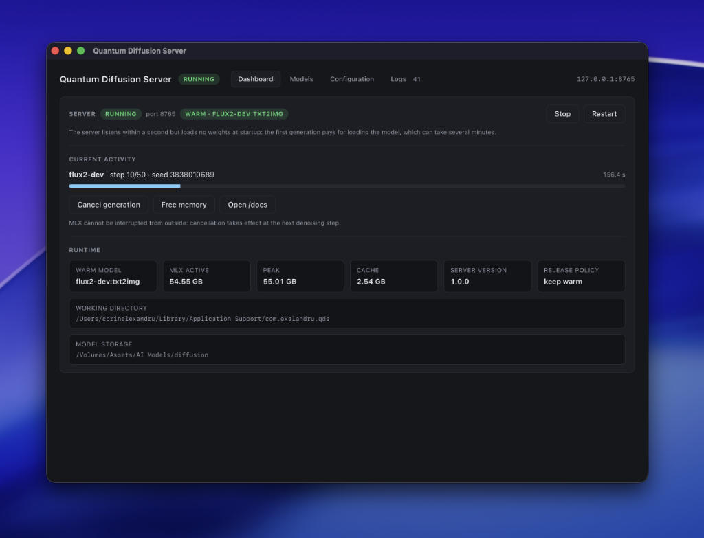
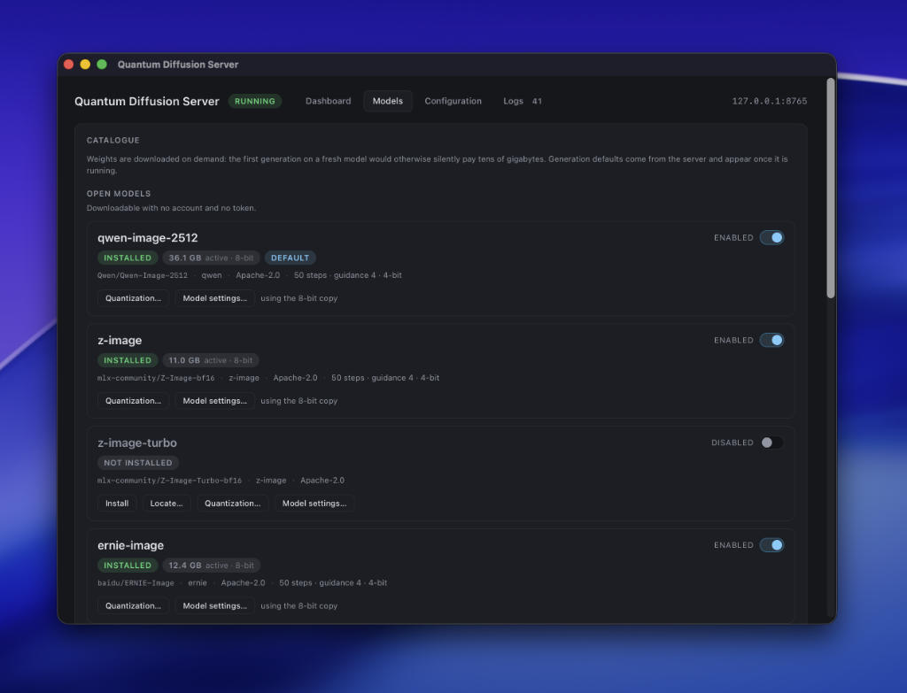

# Quantum Diffusion Server

OpenAI Image compatible server for running local Diffusion Models on Apple Silicon. Features a GUI control panel for model management, runtime quantization, pre-quantized variants, local model import, and Hugging Face downloads.




## What is QDS?

Quantum Diffusion Server turns a Mac into an image generation endpoint. It runs
FLUX, Qwen-Image, Z-Image, ERNIE-Image, FIBO and Ideogram locally on Apple
Silicon, and exposes them through the **same HTTP API as OpenAI's Images
endpoint** - so anything that already speaks to `images.generate` (Misty Studio,
Open WebUI, the `openai` SDK, your own script) can be pointed at
`http://127.0.0.1:8765/v1` and keep working. No account, no per-image cost, no
prompt or image leaving the machine.

The double-clickable app is the part you interact with. It installs its own
Python environment on first launch, downloads model weights on demand, starts
and supervises the server, shows generation progress live, and exposes every
setting as a form. Nothing to install beforehand, no terminal required, no
global Python or Homebrew involvement.

What makes it different from calling a command-line tool per image: **the model
stays loaded in memory between requests**. A generation that costs 34s as a
fresh subprocess costs 18.5s here, and the saving repeats on every image. Since
that resident model also confiscates unified memory, an idle timer can hand it
back automatically when you stop generating - a knob rather than a compromise.

**Requirements:** an Apple Silicon Mac (M1 or later) on macOS 14 or newer. Count
roughly 1.1 GB for the Python environment plus whatever the models weigh -
several GB each, tens of GB for the largest, all shown per model in the app
before you download anything. Memory is the real constraint rather than disk:
the two models enabled by default are small and quantized to 4 bits, while the
20B and 32B entries in the catalogue assume a large-memory machine - FLUX.2-dev
holds ~58 GB resident while it generates.


## Features

- **OpenAI-Images-compatible API** - `/v1/images/generations` and
  `/v1/images/edits`, standard request and error shapes, `/v1/models`, and
  interactive documentation at `/docs`. Existing clients need no adapter.
- **One warm model, ~1.8× faster per image** - weights are loaded once and
  reused, instead of paying a Python start-up and a weight rematerialization for
  every generation.
- **Ten models in one catalogue**, each with its own defaults taken from its own
  model card rather than a blanket setting. Switching model is a request field.
- **Weights on demand** - the Models tab lists the whole catalogue with its
  licence, local availability and disk usage. Install from Hugging Face, locate
  an existing compatible copy, or import a local model without copying its
  weights. Model management works with the generation server stopped.
- **Runtime and pre-quantization** - supported models can quantize while loading
  without writing another copy, or create reusable pre-quantized variants on
  disk. Large models can be converted component by component to keep peak memory
  bounded, and saved variants can be activated independently of the source model.
- **Gives the memory back** - `idle_unload_s` releases the model after a chosen
  period of inactivity, so a chat model or a build can have the RAM when you are
  not generating. Or press *Free memory* in the app.
- **Live progress, and a stop button** - step-by-step progress over
  Server-Sent Events, surfaced in the dashboard with elapsed time and a cancel
  that leaves the server usable.
- **Configuration as a form** - port, API key, CORS, timeouts, image retention,
  default model, Hugging Face access, and independent storage locations for HF
  source weights and QDS pre-quantized artifacts. Per-model controls live in the
  Models tab and are driven by the capabilities reported by the backend.
- **Editing and img2img** - instruction editing on the models that have an edit
  variant, image-to-image on the others, over the standard edits endpoint.
- **Readable logs** - structured events and raw output side by side, filterable
  by level, in the app's Logs tab.
- **Local by default** - binds to `127.0.0.1`; opening it to the network
  requires setting an API key, which the server enforces rather than suggests.


## Getting started

There is no signed release: build the app once, from a clone.

```sh
make install         # dependencies (needs Node, Rust and uv on the PATH)
make build-desktop   # → dist/desktop/QDS.app and QDS.dmg
```

The bundle is ad-hoc signed and not notarized, so after moving it between
machines macOS may need convincing: `xattr -d com.apple.quarantine "QDS.app"`
(the quotes matter, the name contains spaces).

Then, in the app:

1. **First launch** installs the Python environment - around 1.1 GB of
   download, shown live. It happens once.
2. **Models tab** - pick a model and press *Install* to fetch its weights.
   `z-image-turbo` and `ernie-image-turbo` are enabled out of the box: both are
   Apache-2.0 and ungated, so a fresh install generates with no HuggingFace
   token, no access request and no licence to accept.
3. **Dashboard** - *Start*. The server answers within a second; the first
   generation is what actually loads the weights.
4. Point your client at `http://127.0.0.1:8765/v1`. Any API key value works
   unless you set one in the Configuration tab.

```sh
curl http://127.0.0.1:8765/v1/images/generations \
  -H "Content-Type: application/json" \
  -d '{"prompt": "a red fox in the snow", "size": "1280x720"}'
```

```python
from openai import OpenAI

client = OpenAI(base_url="http://127.0.0.1:8765/v1", api_key="unused")
result = client.images.generate(prompt="a red fox in the snow", size="1280x720")
print(result.data[0].url)
```

Prefer the command line, or running on a headless Mac? The server works on its
own: `make dev-server`, or the `mflux-server` console script from the wheel. The
app is a control panel over it, not a wrapper around it.


## Models



| model | licence | enabled by default | notes |
|---|---|---|---|
| `z-image-turbo` | Apache-2.0 | ✅ | the default; 9 steps, fast |
| `ernie-image-turbo` | Apache-2.0 | ✅ | 8 steps, fast |
| `z-image` | Apache-2.0 | - | 50 steps, adjustable guidance |
| `ernie-image` | Apache-2.0 | - | 50 steps |
| `qwen-image-2512` | Apache-2.0 | - | 20B, strong text rendering, optional editing |
| `flux2-klein` | FLUX Non-Commercial 🔒 | - | 9B distilled, 4 steps, instruction editing |
| `flux2-dev` | FLUX Non-Commercial 🔒 | - | 32B; raw HF source with bounded-memory pre-quantized variants |
| `fibo-lite` | CC-BY-NC-4.0 🔒 | - | prompts are structured JSON |
| `fibo` | CC-BY-NC-4.0 🔒 | - | prompts are structured JSON |
| `ideogram-4` | Ideogram Non-Commercial 🔒 | - | sampler presets instead of a step count |

🔒 = gated on HuggingFace: you need a token whose access has been approved. The
token is configured in the Configuration tab, and gated models ship disabled
because requesting that access - and accepting a non-commercial licence - is
your decision, not the app's. Enable or disable models directly from the Models
tab.

Built-in models can be installed from Hugging Face or pointed at an existing
compatible local directory with *Locate…*. The Models tab can also register
additional local models with a stable API name. QDS keeps source weights and
pre-quantized variants separate: creating or activating a saved variant does not
replace the original model source.

The full capability matrix - steps, guidance, negative prompts, prompt format,
img2img and editing per model - is in
[`src/server/README.md`](src/server/README.md#models), and the running server
reports its effective version at `GET /v1/capabilities`.


## Using it from your own code

Beyond the OpenAI fields (`prompt`, `model`, `n`, `size`, `response_format`),
requests accept a few extras that the OpenAI SDKs pass through harmlessly:
`steps`, `seed`, `guidance`, `negative_prompt`, `strength` on edits, and
`response_format: "raw"` for the PNG bytes. Parameters with no local equivalent
(`quality`, `style`, `user`…) are accepted and ignored rather than rejected.

A few endpoints are additions rather than OpenAI shapes: `/v1/progress` for
Server-Sent Events, `/v1/cancel`, `/v1/unload`, `/v1/capabilities`, and a
`/health` that stays public even with an API key set. All of it, plus the
complete configuration reference, is documented in
[`src/server/README.md`](src/server/README.md).

Worth knowing before you build on it: **one generation at a time**. Concurrent
requests are queued rather than refused, and `n > 1` produces images
sequentially. That is deliberate - on unified memory two live models saturate
the machine.


## Licence

The code in this repository is MIT licensed - see [LICENSE](LICENSE).

**Model weights are not.** Each entry in the catalogue carries its own licence,
listed in the table above and enforced by nobody but you: the FLUX and Ideogram
models are non-commercial, FIBO is CC-BY-NC-4.0, and five of the ten are gated
behind an access request. Only the Apache-2.0 models are enabled out of the box.

QDS is a client of [mflux](https://github.com/filipstrand/mflux) (MIT), which
does the actual MLX inference.


## Development

### Common commands

```sh
make install
make test
make lint
make dev-server
make dev-desktop
make build
make clean
```

Run `make help` for the complete list.


### Repository layout

This repository contains two applications:

- [`src/server`](src/server/README.md): the Python API server exposing mflux
  through an OpenAI Images-compatible API.
- [`src/desktop`](src/desktop/README.md): the Tauri and React macOS control
  panel.


```text
src/
├── server/       Python package, tests and configuration
└── desktop/      React frontend and Tauri application
build/            disposable compiler output and bundle staging
dist/             distributable wheels, source archives, .app and .dmg files
```

Both `build/` and `dist/` are generated and ignored by Git.
